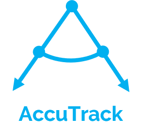

<!-- # AccuTrack
AccuTrack Project Website
-->

<p align="center">
        
</p>


## Inspiration

AccuTrack allows blue-collar workers to track and improve their working posture without disrupting their workflow. Industries such as warehouses and construction require strenuous physical effort to get the job done. Many workers in the blue-collar industry, such as in distribution warehouses, often need to carry heavy packages and items. Repetitive motion over a large period of time causes great amount of strain and damage to the body, which often ends up putting workers out of commission and companies on the line for medical compensation.

In 2017 alone, there were over 23,000 Americans that filed for lost time claims due to injury EACH DAY, most of which are located in sectors that move around heavy items. In total, US  companies have paid over **$192 Billion** for  workplace related injuries last year alone [(source)](https://www.epi.org/publication/workplace-injuries-illnesses-cost-250-billion/). These strain injuries account for 43% of all lost time caused by injuries on the job, and poor body posture is one of the leading factors for strain injuries [(source)](https://www.labour.gov.on.ca/english/hs/pubs/ergonomics/is_ergonomics.php).

## What is AccuTrack?

AccuTrack track the ergonomical activity of blue-collar employees. This could include tracking the movement of their arms and legs using IoT sensors, and transmitting the collected data wirelessly to the cloud for analysis using existing industry standards.

<p align="center">  </p>

AccuTrack uses real-time signal processing and machine learning techniques to filter, process, and analyze the user's motion data. Additionally, AccuTrack provides a web portal that translates the received data into meaningful, interpretable information that the employers can access to assess and reduce the risk of their employees developing strain injuries, which could significantly reduce the costs associated with lost productivity and employee health claims.

<p align="center">  </p>

## How we built AccuTrack
AccuTrack can be largely divided into three major, related components:

**Hardware:** We developed custom wireless flex sensors using tinfoil, pencil-shaded paper to prepare working prototypes on a small budget. This sped up the testing process allowed us to collect real-data for the purposes of developing our data-analysis tools. These sensors are attached to the arms or legs of the user to track their movement as they perform their required tasks.  

**Data Processing:** AccuTrack uses Azure functions to process incoming motion data in real-time. This required us to develop custom signal-processing and machine-learning algorithms that could efficiently filter, compress, store and analyze large amounts of incoming sensor-data for rapid execution on Azure functions platform. We also used some predictive tools to identify trends in employee efficiency over time.

**Front End:** AccuTrack provides a [web-portal](https://accutrack.me) at [accutrack.me](https://accutrack.me) that allows employers to see analytics corresponding to the posture of employees using AccuTrack devices. The web-portal allows employers to gain insights extracted from employee data, such as trends in employee efficiency over time, quality of employee posture, and potential health hazards the employees might face.

## Major Challenges

Developing working prototype of hardware sensors on a small budget was a major challenge for us. We ended up creating our own flex sensor using tinfoil as conductive layers and pencil-shaded paper as the semi-resistive layer. For the case we used sharpeners that collected the shavings where we removed the actual sharpener part and put in our electronics. We also used LiPo batteries from an RC plane for power in order to make our sensors rechargeable. Everything was controlled by an inexpensive Arduino Pro Mini. 

<p align="center">  </p>

Another major challenge for us was to process the large amount of incoming real-time data. Not only did we have to process and display incoming data in real-time, but that data had to be compressed, analyzed, stored at the same time too. Moreover, the trends in employee efficiency had to be updated along with the incoming data, which further constrained resource availability. We had to develop custom data compression and noise filtering algorithms for improved performance so as to minimize the delay between data-generation and data-availability on the AccuTrack web-portal.

<!--
Moreover, displaying large amounts of data on a single screen without excessive resource consumption was also a major problem. This included displaying the real-time data, the trendline and the historical ergonomic efficiency of each employee.
Multiple iterations were required in order to come up with a website design that provides a good user experience. Another challenge was that we had to poll the frequency at which data was displayed on the website, especially on the realtime graph so that we don't
utilize high amount of CPU.
-->

## Accomplishments

We are really proud of developing the hardware for our project. We believe that it completes the entire AccuTrack ecosystem by allowing us to use real data to study and understand patterns in human ergonomic efficiency. Availability of real data allowed us to model human ergonomics in a more quantitative manner. We believe AccuTrack ecosystems is largely complete and is a reasonably good representation of how we envisioned it.

## Lessons Learnt
There was a lot that we learnt from this project. Firstly, we all learnt how to work as a team and co-ordinate with one another to 
complete the tasks by the main deadline. Since we are all university students, our resources and overall budget for producing expensive hardware 
were very limited. Hence, we had to make the best use of the amount of money we could afford to spend in order to make working hardware that would give 
us accurate results. We also learnt extensively about several new Microsoft technologies such as Azure Functions etc. These technologies made our tasks
much easier since they removed much of the hassle involved in setting up custom servers. Furthermore, we all learnt a little bit about one antoher's area of expertise. For example, the front end developer learnt a lot about hardware
development while the back-end developer learnt a lot about front-end web development too. Overall, we think that this project was certainly a great experience and was a great learning opportunity for us.

<p align="center">  </p>

## What's next for test

FILL THIS DAN AND JOSHI

<!--

Format your description with Markdown. Here are some tips:

## Headline
**bold**
_ italics _
[link](http://foo.bar)

        
Get fancy with syntax highlighting:

```ruby
require 'redcarpet'
markdown = Redcarpet.new("Hello World!")
puts markdown.to_html
```
-->
